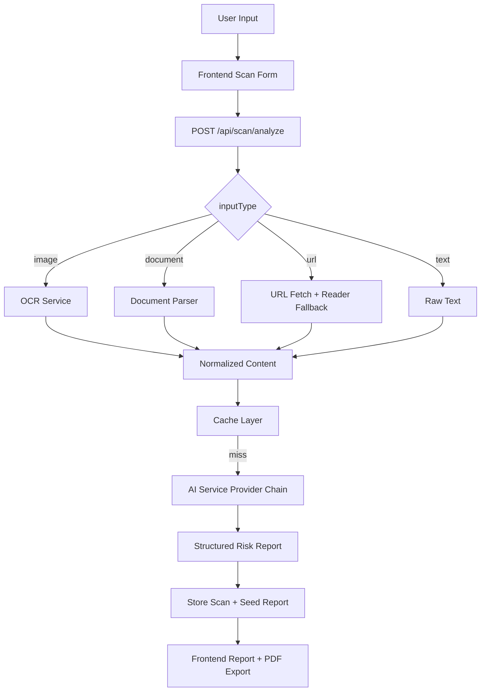

# RakshaX AI

RakshaX AI is a production-focused MERN platform for scam detection and user protection.

## Highlights

- JWT auth with role-based access (`user`, `admin`)
- Scam analyzer for text, URL, image, and document inputs
- URL intelligence (page fetch + fallback reader parsing)
- AI provider chain: AI Pipe/OpenRouter -> OpenAI -> Ollama
- Detailed report fields: score, confidence, verdict, category, red/green flags, summary
- Community voting with email report notifications
- Vote report recipient selection: login email + custom extra emails
- Admin analytics and trends dashboard
- Dockerized full stack (`frontend`, `backend`, `mongo`, `redis`)

## Input Types Supported

- `text`: SMS/WhatsApp/email content
- `url`: website URL + optional context text
- `image`: screenshot OCR extraction
- `document`: `.pdf`, `.txt`, `.docx`, `.csv`, `.json`

## Report Output

Each scan returns:

- `scamScore` (0-100)
- `confidence` (0-100)
- `verdict` (`safe` | `suspicious` | `scam`)
- `category` (`phishing`, `job scam`, `upi fraud`, etc.)
- `analysisSummary`
- `explanation`
- `redFlags[]`
- `greenFlags[]`
- `recommendedAction`
- `providerUsed` (actual provider/model used, for example `aipipe-openrouter:openai/gpt-4.1`)

## Scan Context Types

`contextType` options:

- `general`
- `payment-request`
- `terms-conditions`
- `documents`
- `job-offer`
- `social-message`
- `email`

## Architecture Flow



## Tech Stack

### Frontend

- React (Vite)
- Tailwind CSS
- Axios
- React Router
- Recharts
- jsPDF + html2canvas

### Backend

- Node.js + Express
- MongoDB + Mongoose
- Redis (optional cache)
- Multer, Tesseract.js, pdf-parse, mammoth
- Joi validation

## Environment Variables

Backend `.env` example in [backend/.env.example](backend/.env.example)

Important variables:

- `AIPIPE_TOKEN`
- `AIPIPE_OPENROUTER_MODEL` (recommended: `openai/gpt-4.1`)
- `OPENAI_API_KEY`
- `OPENAI_MODEL` (recommended: `gpt-4.1`)
- `AI_STRATEGY` (`api-first` recommended)
- `OLLAMA_BASE_URL`, `OLLAMA_MODEL`
- `EMAIL_ALERTS_ENABLED`
- `MAIL_SERVER`, `MAIL_PORT`, `MAIL_USE_TLS`, `MAIL_USERNAME`, `MAIL_PASSWORD`, `MAIL_FROM`

Frontend `.env`:

- `VITE_API_URL=http://localhost:5000/api`

## API Endpoints

### Auth

- `POST /api/auth/register`
- `POST /api/auth/login`
- `GET /api/auth/me`

### Scan

- `POST /api/scan/analyze`
- `GET /api/scan/history`
- `GET /api/scan/community`

### Report

- `POST /api/report/vote`
- `GET /api/report/:scanId`

`POST /api/report/vote` request supports:

```json
{
  "scanId": "<scan_id>",
  "voteType": "up",
  "tags": ["phishing"],
  "includeAccountEmail": true,
  "additionalEmails": ["team@example.com", "family@example.com"]
}
```

Vote response includes:

- `trustScore` (community safe consensus)
- `scamConsensusScore` (community scam consensus)
- `notifications.recipients[]`

### Admin

- `GET /api/admin/overview`
- `PATCH /api/admin/flag`

### Trends

- `GET /api/trends/summary?days=30`

## Docker Run

From project root:

```bash
docker compose up -d --build
```

Services:

- Frontend: `http://localhost:5173`
- Backend: `http://localhost:5000/api`
- Health: `http://localhost:5000/api/health`

Stop:

```bash
docker compose down
```

## Notes

- If AI keys are missing/unavailable and Ollama is not running, analysis request fails with clear configuration error.
- For strongest results, set a real `AIPIPE_TOKEN` or `OPENAI_API_KEY`.
- Vote emails include mark type, reported item, category, scores, and recommendation.
